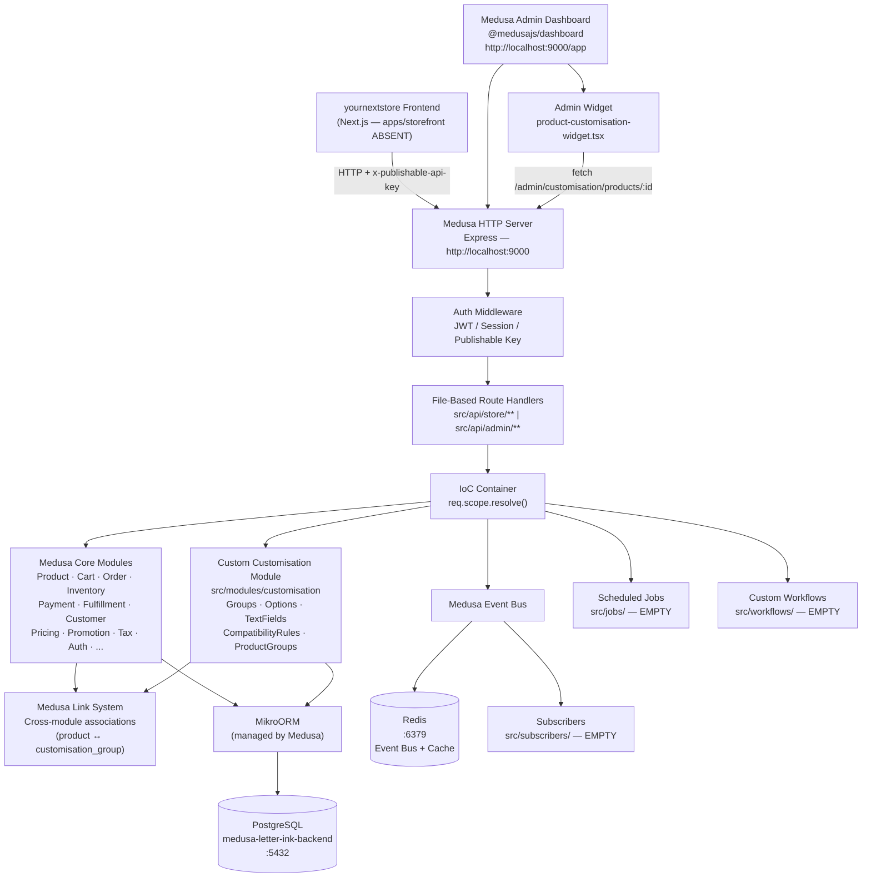
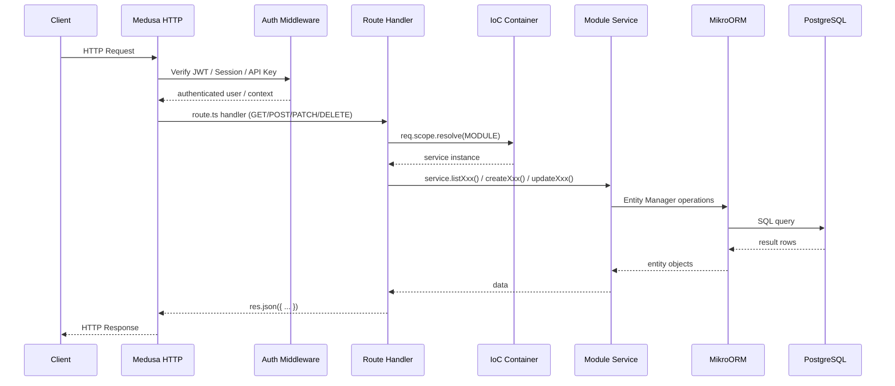
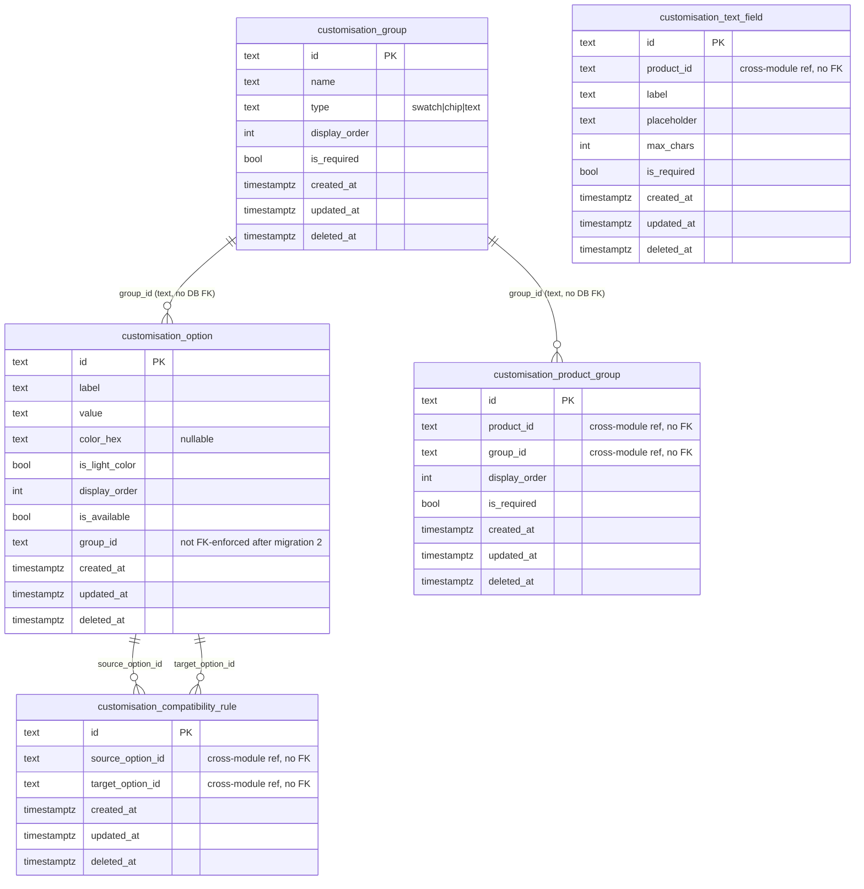
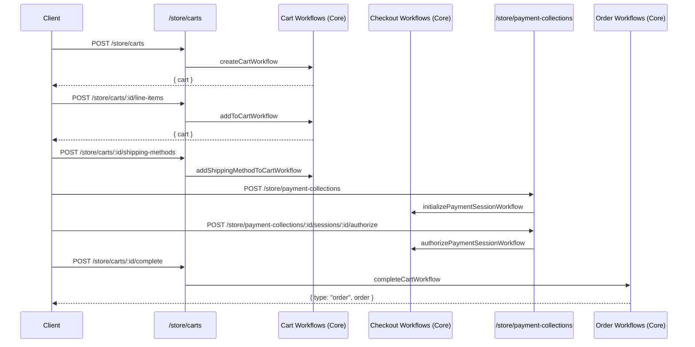
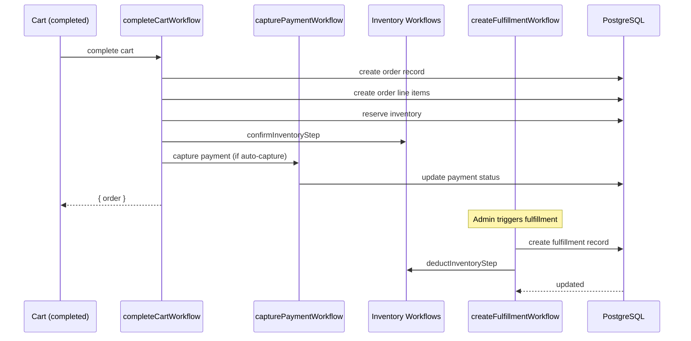
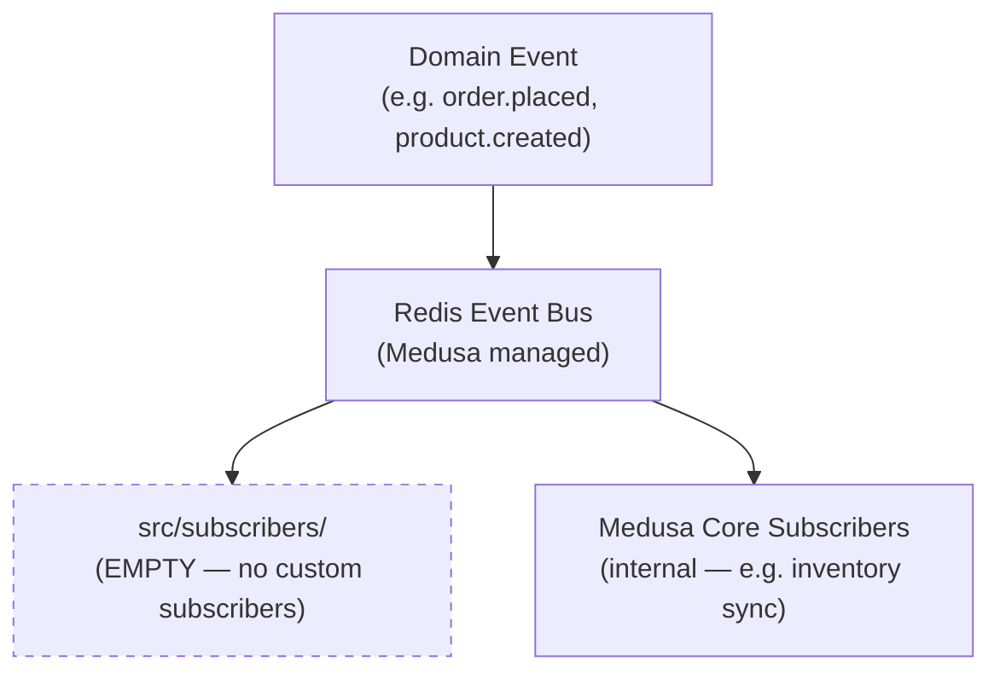

# 06 — System Architecture
## letter-ink-backend · Medusa 2.21.0

> **Analysis only. Do not modify the codebase.**

---

## 1. Architectural Style

**Medusa Modular Architecture** — a framework-opinionated modular monolith where:

- Medusa core provides ~18 commerce domain modules, each with its own isolated database schema
- Business logic runs inside **workflows** composed of typed, transactional steps
- The HTTP layer is entirely **file-based** (`src/api/store|admin/**/route.ts`)
- Cross-module data relationships use a **link system** (not SQL foreign keys between module schemas)
- All services are accessed through Medusa's built-in **IoC container** (`req.scope.resolve(MODULE)`)
- Background processing uses **Redis-backed event bus** with subscriber pattern

---

## 2. High-Level Architecture Diagram

---

## 3. Request Lifecycle (Simplified)

---

## 4. Module Architecture

```mermaid
flowchart TD
    subgraph "Medusa Core Modules"
        PRODUCT["Product Module\nproduct, variant, option\ncategory, collection, image"]
        CART["Cart Module\ncart, line_item\nshipping, discount"]
        ORDER["Order Module\norder, order_item\nreturn, fulfillment_ref"]
        INVENTORY["Inventory Module\ninventory_item\ninventory_level\nreservation"]
        STOCK["Stock Location Module\nstock_location\nstock_location_address"]
        PAYMENT["Payment Module\npayment_collection\npayment, payment_session"]
        FULFILLMENT["Fulfillment Module\nfulfillment_set\nservice_zone, geo_zone\nshipping_option, fulfillment"]
        CUSTOMER["Customer Module\ncustomer, customer_group\naddress"]
        PRICING["Pricing Module\nprice_set, price_rule\ncurrency, money_amount"]
        PROMOTION["Promotion Module\npromotion, campaign\ndiscount_rule"]
        TAX["Tax Module\ntax_region, tax_rate\ntax_provider"]
        AUTH["Auth Module\nauth_identity\nprovider_identity"]
        STORE["Store Module\nstore, store_currency"]
        NOTIFICATION["Notification Module\nnotification, notification_provider"]
        FILE["File Module\nfile_upload, file_provider"]
        APIKEY["API Key Module\napi_key (publishable/secret)"]
        SALESCHANNEL["Sales Channel Module\nsales_channel"]
        CURRENCY["Currency Module\ncurrency definitions"]
    end

    subgraph "Custom Application Module"
        CUSTOMISATION["Customisation Module\nCustomisationGroup\nCustomisationOption\nCustomisationTextField\nCustomisationCompatibilityRule\nCustomisationProductGroup"]
    end

    subgraph "Module Links (cross-module associations)"
        LINK1["product ↔ customisation_group\n(1-to-many)\nsrc/links/product-customisation.ts"]
        LINK2["stock_location ↔ fulfillment_provider"]
        LINK3["stock_location ↔ fulfillment_set"]
        LINK4["sales_channel ↔ api_key"]
        LINK5["sales_channel ↔ stock_location"]
    end

    PRODUCT --- LINK1
    CUSTOMISATION --- LINK1
    STOCK --- LINK2
    FULFILLMENT --- LINK2
    STOCK --- LINK3
    FULFILLMENT --- LINK3
    SALESCHANNEL --- LINK4
    APIKEY --- LINK4
    SALESCHANNEL --- LINK5
    STOCK --- LINK5
```

---

## 5. Database Schema Overview (Custom Module)

---

## 6. Checkout Flow (Medusa Core — unchanged)

---

## 7. Order Flow (Medusa Core — unchanged)

---

## 8. Event-Driven Architecture

**Status:** No custom event subscribers have been implemented. The event bus is active (Redis connected) but no application-specific events are being consumed.

---

## 9. Application Boundaries

| Boundary | Owner | Status |
|---|---|---|
| Store HTTP API (`/store/*`) | Medusa core + custom | Active |
| Admin HTTP API (`/admin/*`) | Medusa core + custom | Active |
| Admin Dashboard (`/app`) | Medusa dashboard | Active |
| Custom Admin Widget | Application | Active (with broken import) |
| Event Subscribers | Application | Absent |
| Scheduled Jobs | Application | Absent |
| Custom Workflows | Application | Absent |
| Storefront (`apps/storefront/`) | Application | Absent |

---

## 10. Key Architectural Decisions Observed

| Decision | Implementation | Notes |
|---|---|---|
| Module isolation | Each module owns its own DB schema | Cross-module data via links, not SQL FKs |
| Dependency injection | Medusa IoC container via `req.scope.resolve()` | No direct imports of service instances |
| File-based routing | `route.ts` convention | No router registration |
| Workflows for business logic | Convention (not yet followed for custom code) | All custom logic is in route handlers |
| Soft deletes | All custom tables have `deleted_at` | Consistent with Medusa core |
| No microservices | Single Node.js process | Appropriate for current scale |
| Redis for events + cache | Configured, not heavily used by custom code | Framework manages core usage |
