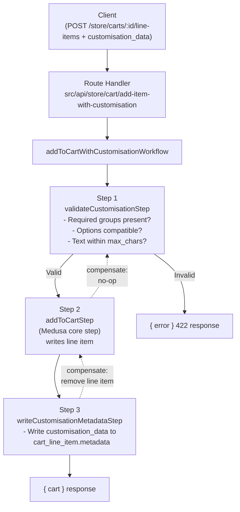

# 20 — Workflow Architecture
## letter-ink-backend · Medusa Workflow System Analysis

> **Analysis only. Do not modify the codebase.**

---

## 1. Workflow System Overview

Medusa's workflow engine is a first-class framework primitive — not a third-party library. Key properties:

| Property | Value |
|---|---|
| **SDK** | `@medusajs/framework/workflows-sdk` |
| **Pattern** | Directed Acyclic Graph (DAG) of steps |
| **Transaction** | Each workflow is a distributed transaction — steps can compensate on failure |
| **Idempotency** | Built-in — workflows track execution state |
| **Async** | Can be long-running; supports async steps |
| **Observability** | Optional OpenTelemetry tracing (`instrument: { workflows: true }`) |

---

## 2. Workflow Primitives

### `createStep`

```typescript
const myStep = createStep(
  "step-name",
  async (input, context) => {
    // Forward execution
    return new StepResponse(result, rollbackData)
  },
  async (rollbackData, context) => {
    // Compensation on failure — runs if a later step fails
  }
)
```

### `createWorkflow`

```typescript
const myWorkflow = createWorkflow(
  "workflow-name",
  (input: WorkflowInput) => {
    const result1 = step1(input)
    const result2 = step2({ ...input, data: result1 })
    return new WorkflowResponse(result2)
  }
)
```

### Execution

```typescript
// From a route handler:
const { result } = await myWorkflow(req.scope).run({ input: { ... } })

// From another workflow:
const result = myWorkflow.runAsStep({ input: { ... } })
```

---

## 3. Core Workflows Used in This Repository

### Workflows called directly in `initial-data-seed.ts`

| Workflow | Package | Purpose |
|---|---|---|
| `createSalesChannelsWorkflow` | `@medusajs/medusa/core-flows` | Create sales channels |
| `createApiKeysWorkflow` | `@medusajs/medusa/core-flows` | Create publishable API keys |
| `linkSalesChannelsToApiKeyWorkflow` | `@medusajs/medusa/core-flows` | Link channels to keys |
| `createStoresWorkflow` | `@medusajs/medusa/core-flows` | Create store |
| `createRegionsWorkflow` | `@medusajs/medusa/core-flows` | Create regions |
| `createTaxRegionsWorkflow` | `@medusajs/medusa/core-flows` | Create tax regions |
| `createStockLocationsWorkflow` | `@medusajs/medusa/core-flows` | Create warehouses |
| `createShippingOptionsWorkflow` | `@medusajs/medusa/core-flows` | Create shipping options |
| `createShippingProfilesWorkflow` | `@medusajs/medusa/core-flows` | Create shipping profiles |
| `createProductCategoriesWorkflow` | `@medusajs/medusa/core-flows` | Create categories |
| `createProductOptionsWorkflow` | `@medusajs/medusa/core-flows` | Create product options |
| `createProductsWorkflow` | `@medusajs/medusa/core-flows` | Create products |
| `createCollectionsWorkflow` | `@medusajs/medusa/core-flows` | Create collections |
| `createInventoryLevelsWorkflow` | `@medusajs/medusa/core-flows` | Set stock levels |
| `linkSalesChannelsToStockLocationWorkflow` | `@medusajs/medusa/core-flows` | Link channels to locations |

### Core Checkout Workflows (active, used by Medusa internally)

| Workflow | Purpose |
|---|---|
| `createCartWorkflow` | Cart creation |
| `addToCartWorkflow` | Add line item to cart |
| `updateCartWorkflow` | Update cart fields |
| `addShippingMethodToCartWorkflow` | Add shipping method |
| `completeCartWorkflow` | Complete cart → create order |
| `capturePaymentWorkflow` | Capture payment |
| `createFulfillmentWorkflow` | Create fulfillment |
| `createReturnWorkflow` | Create return |

---

## 4. Custom Workflows

**Current count: 0**

The `src/workflows/` directory contains only a `README.md` with example code.

**This is a critical gap.** Per the Medusa architecture convention (documented in `AGENTS.md`): 
> "Business logic belongs in workflows, not in route handlers."

Currently, all custom business logic is in route handlers directly. This violates the architecture convention and means:
- Logic cannot be reused from subscribers or cron jobs
- Logic has no compensation (rollback) capability
- Logic cannot be composed into larger workflows

---

## 5. Workflows That Need to Be Built for The Letter Ink

| Workflow | Steps | Priority |
|---|---|---|
| `validateCustomisationWorkflow` | 1. Validate required groups selected, 2. Validate compatibility, 3. Validate text field max_chars | **Critical** |
| `addToCartWithCustomisationWorkflow` | 1. validateCustomisation, 2. addToCart (core), 3. write metadata to line item | **Critical** |
| `validateCustomisationAtCheckoutStep` | Re-validate customisation before order completion | **High** |
| `createProductionOrderWorkflow` | 1. Create production record, 2. Notify production team | **High** |
| `updateProductionStatusWorkflow` | 1. Validate status transition, 2. Update status, 3. Trigger notifications | **High** |
| `completeProductionWorkflow` | 1. Mark production complete, 2. Create fulfillment (core), 3. Notify customer | **High** |
| `createCustomisationGroupWorkflow` | 1. Validate input, 2. Create group | Medium |
| `linkProductToCustomisationWorkflow` | 1. Validate product exists, 2. Create product-group link | Medium |

---

## 6. Workflow Architecture for Customisation (Design)



---

## 7. Key Insight: Medusa's `completeCartWorkflow` Propagates Metadata

When `completeCartWorkflow` runs, Medusa automatically copies `cart_line_item.metadata` to `order_line_item.metadata`. This means:

**If customisation data is written to cart line item metadata in Step 3 above, it automatically appears on the order line item — zero additional work required for the transfer.**

This is the strongest argument for using `cart_line_item.metadata` (Option A) rather than building a custom table (Option B).

---

## 8. Workflow Testing

Medusa provides `@medusajs/test-utils` which includes helpers to bootstrap a test instance of the Medusa framework for workflow testing.

```typescript
// Test pattern for workflow testing
import { moduleIntegrationTestRunner } from "@medusajs/test-utils"

moduleIntegrationTestRunner({
  moduleName: CUSTOMISATION_MODULE,
  testSuite: ({ service }) => {
    it("should validate compatible selections", async () => {
      // ... setup + execute + assert
    })
  }
})
```
