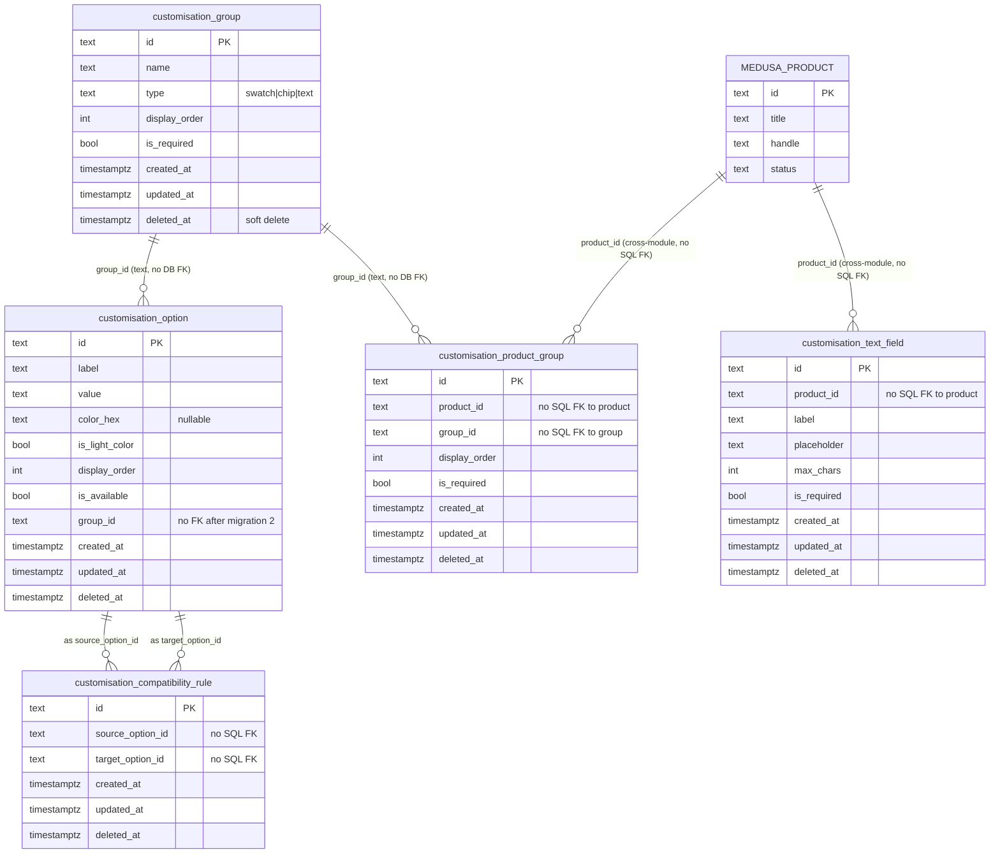
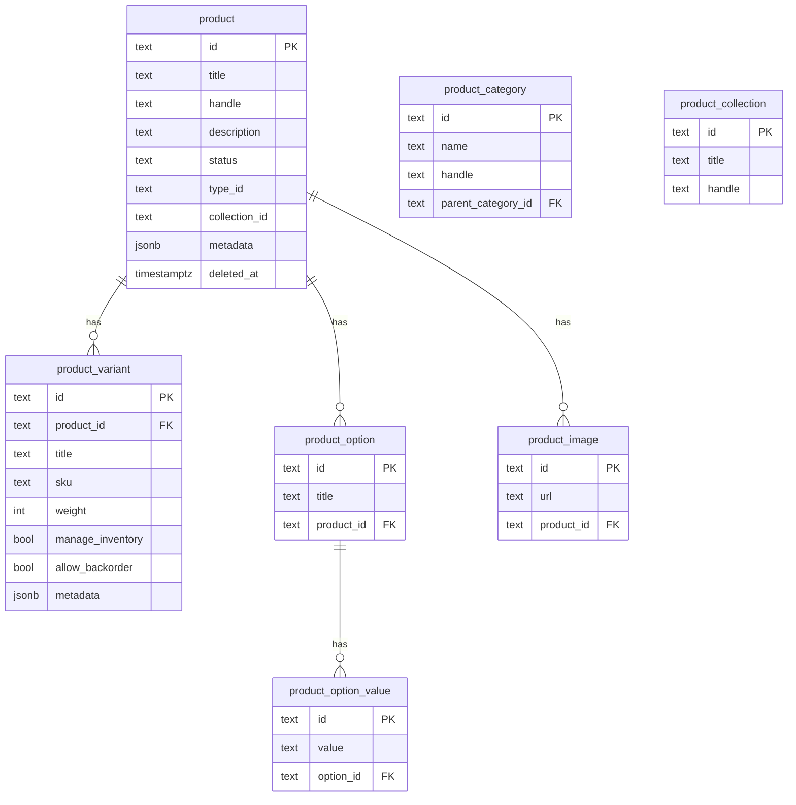
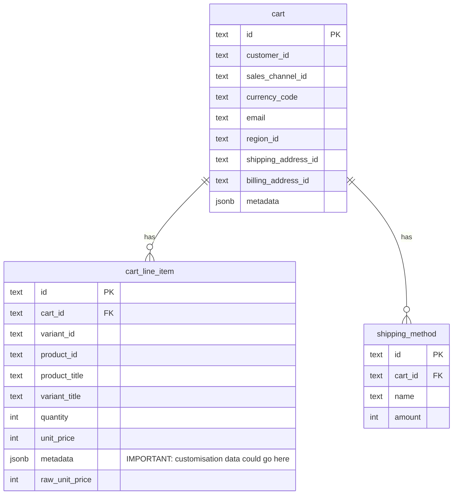
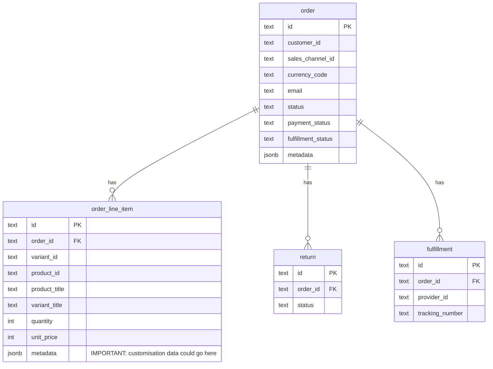
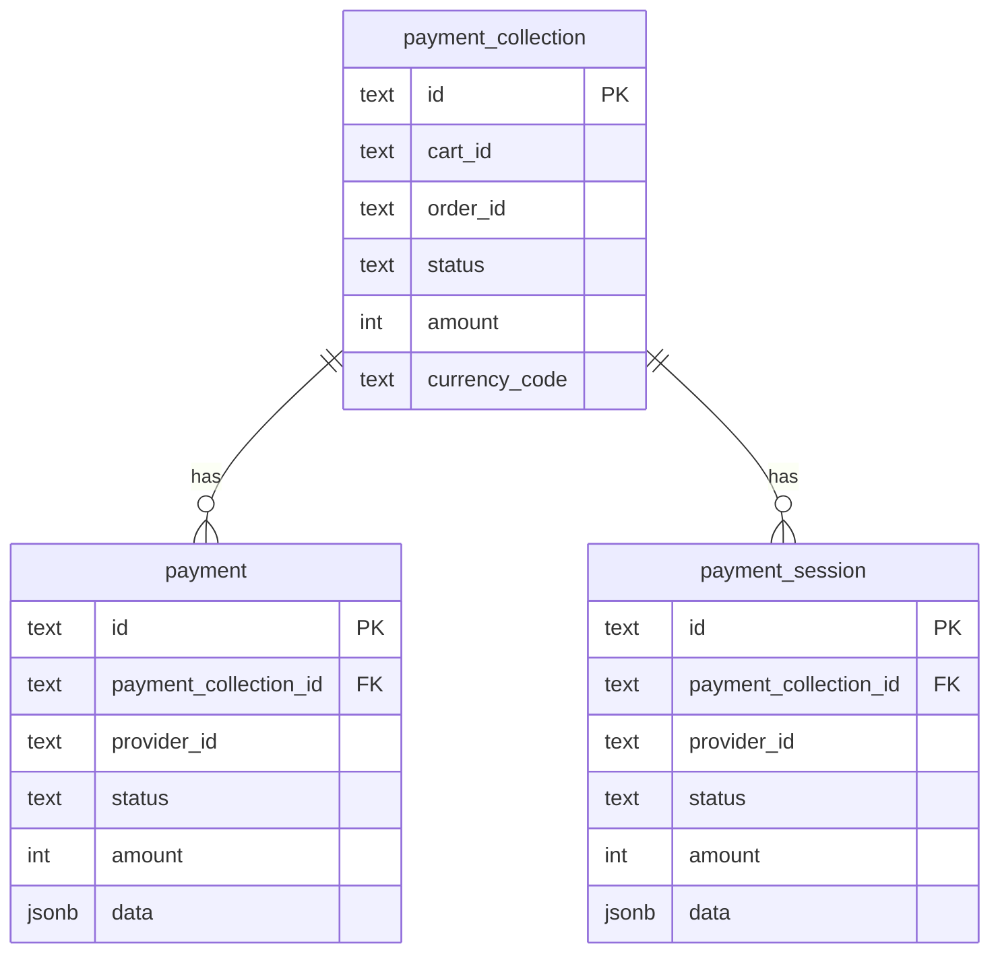

# 22 — Database Architecture
## letter-ink-backend · Complete Schema Analysis

> **Analysis only. Do not modify the codebase.**

---

## 1. Database Overview

| Property | Value |
|---|---|
| Engine | PostgreSQL (≥15 required) |
| Database name | `medusa-letter-ink-backend` |
| Host (dev) | `localhost:5432` |
| ORM | MikroORM (managed entirely by Medusa framework) |
| Schema strategy | Module isolation — each module owns its own tables |
| FK strategy | Within-module: SQL FKs enforced by ORM · Cross-module: Medusa link system (no SQL FKs) |
| Soft deletes | All Medusa tables and custom tables use `deleted_at` with partial index |
| ID format | `text` (Medusa uses ULID/nanoid format, e.g., `prod_01HXYZ...`) |

---

## 2. Schema Ownership

| Schema Owner | Approx. Table Count | Notes |
|---|---|---|
| Medusa core modules | ~60+ | Managed by Medusa migrations — do not touch |
| Medusa link system | ~10+ | Pivot tables for cross-module associations |
| Custom `customisation` module | **5** | Managed by application migrations |

---

## 3. Complete Custom Schema (Evidence-Based)

### Table: `customisation_group`

```sql
CREATE TABLE IF NOT EXISTS "customisation_group" (
  "id"            text NOT NULL,
  "name"          text NOT NULL,
  "type"          text CHECK ("type" IN ('swatch', 'chip', 'text')) NOT NULL,
  "display_order" integer NOT NULL DEFAULT 0,
  "is_required"   boolean NOT NULL DEFAULT false,
  "created_at"    timestamptz NOT NULL DEFAULT now(),
  "updated_at"    timestamptz NOT NULL DEFAULT now(),
  "deleted_at"    timestamptz NULL,
  CONSTRAINT "customisation_group_pkey" PRIMARY KEY ("id")
);

CREATE INDEX IF NOT EXISTS "IDX_customisation_group_deleted_at"
  ON "customisation_group" ("deleted_at")
  WHERE deleted_at IS NULL;
```

**Source:** `Migration20260916121529.ts:6-7`

---

### Table: `customisation_option`

```sql
CREATE TABLE IF NOT EXISTS "customisation_option" (
  "id"             text NOT NULL,
  "label"          text NOT NULL,
  "value"          text NOT NULL,
  "color_hex"      text NULL,
  "is_light_color" boolean NOT NULL DEFAULT false,
  "display_order"  integer NOT NULL DEFAULT 0,
  "is_available"   boolean NOT NULL DEFAULT true,
  "group_id"       text NOT NULL,       -- was FK in migration 1, dropped in migration 2
  "created_at"     timestamptz NOT NULL DEFAULT now(),
  "updated_at"     timestamptz NOT NULL DEFAULT now(),
  "deleted_at"     timestamptz NULL,
  CONSTRAINT "customisation_option_pkey" PRIMARY KEY ("id")
);

CREATE INDEX IF NOT EXISTS "IDX_customisation_option_deleted_at"
  ON "customisation_option" ("deleted_at")
  WHERE deleted_at IS NULL;

-- NOTE: Migration 1 created this FK and index, Migration 2 dropped them:
-- ALTER TABLE "customisation_option"
--   ADD CONSTRAINT "customisation_option_group_id_foreign"
--   FOREIGN KEY ("group_id") REFERENCES "customisation_group" ("id") ON UPDATE CASCADE;
-- CREATE INDEX "IDX_customisation_option_group_id" ON "customisation_option" ("group_id")
--   WHERE deleted_at IS NULL;
```

**Sources:** `Migration20260916121529.ts:9-11`, `Migration20260917064102.ts:12-14`

---

### Table: `customisation_text_field`

```sql
CREATE TABLE IF NOT EXISTS "customisation_text_field" (
  "id"          text NOT NULL,
  "product_id"  text NOT NULL,     -- references medusa product.id, no SQL FK
  "label"       text NOT NULL,
  "placeholder" text NOT NULL,
  "max_chars"   integer NOT NULL DEFAULT 120,
  "is_required" boolean NOT NULL DEFAULT false,
  "created_at"  timestamptz NOT NULL DEFAULT now(),
  "updated_at"  timestamptz NOT NULL DEFAULT now(),
  "deleted_at"  timestamptz NULL,
  CONSTRAINT "customisation_text_field_pkey" PRIMARY KEY ("id")
);

CREATE INDEX IF NOT EXISTS "IDX_customisation_text_field_deleted_at"
  ON "customisation_text_field" ("deleted_at")
  WHERE deleted_at IS NULL;
```

**Source:** `Migration20260916121529.ts:13-14`

---

### Table: `customisation_compatibility_rule`

```sql
CREATE TABLE IF NOT EXISTS "customisation_compatibility_rule" (
  "id"               text NOT NULL,
  "source_option_id" text NOT NULL,   -- references customisation_option.id, no SQL FK
  "target_option_id" text NOT NULL,   -- references customisation_option.id, no SQL FK
  "created_at"       timestamptz NOT NULL DEFAULT now(),
  "updated_at"       timestamptz NOT NULL DEFAULT now(),
  "deleted_at"       timestamptz NULL,
  CONSTRAINT "customisation_compatibility_rule_pkey" PRIMARY KEY ("id")
);

CREATE INDEX IF NOT EXISTS "IDX_customisation_compatibility_rule_deleted_at"
  ON "customisation_compatibility_rule" ("deleted_at")
  WHERE deleted_at IS NULL;
```

**Source:** `Migration20260917064102.ts:6-7`

---

### Table: `customisation_product_group`

```sql
CREATE TABLE IF NOT EXISTS "customisation_product_group" (
  "id"            text NOT NULL,
  "product_id"    text NOT NULL,   -- references medusa product.id, no SQL FK
  "group_id"      text NOT NULL,   -- references customisation_group.id, no SQL FK
  "display_order" integer NOT NULL DEFAULT 0,
  "is_required"   boolean NOT NULL DEFAULT false,
  "created_at"    timestamptz NOT NULL DEFAULT now(),
  "updated_at"    timestamptz NOT NULL DEFAULT now(),
  "deleted_at"    timestamptz NULL,
  CONSTRAINT "customisation_product_group_pkey" PRIMARY KEY ("id")
);

CREATE INDEX IF NOT EXISTS "IDX_customisation_product_group_deleted_at"
  ON "customisation_product_group" ("deleted_at")
  WHERE deleted_at IS NULL;
```

**Source:** `Migration20260917064102.ts:9-10`

---

## 4. Full Custom Schema ER Diagram



---

## 5. Medusa Core Schema (Representative Tables)

Medusa 2.x manages its own schema through its internal migrations. Below is a representative subset:

### Catalog Domain



### Cart Domain



### Order Domain



### Payment Domain



---

## 6. Data Ownership Matrix

| Entity | Created By | Updated By | Deleted By | API Exposed |
|---|---|---|---|---|
| `customisation_group` | Admin via POST | Admin via PATCH | Admin via DELETE | Admin + Store (assembled) |
| `customisation_option` | Admin via POST | Admin via PATCH | Admin via DELETE | Admin + Store (assembled) |
| `customisation_text_field` | Admin via POST | Admin via PATCH | Admin via DELETE | Admin + Store |
| `customisation_compatibility_rule` | Admin via POST | — | Admin via DELETE | Admin + Store (assembled) |
| `customisation_product_group` | Admin via POST | — | (not implemented) | Admin + Store |
| Medusa products | Admin dashboard / API | Admin | Admin | Store + Admin |
| Medusa cart | Store API | Store API | Auto (TTL) | Store |
| Medusa order | Checkout workflow | Admin | Admin | Store + Admin |
| Medusa customer | Store registration | Customer/Admin | Admin | Store + Admin |

---

## 7. Database Concerns and Risks

| # | Concern | Tables Affected | Risk |
|---|---|---|---|
| DB-1 | **No unique constraint** on `customisation_product_group (product_id, group_id)` — duplicates possible | `customisation_product_group` | Medium |
| DB-2 | **No unique constraint** on `customisation_compatibility_rule (source_option_id, target_option_id)` — duplicate rules possible | `customisation_compatibility_rule` | Medium |
| DB-3 | **No index on `group_id`** in `customisation_option` after FK was dropped | `customisation_option` | Low (small table now, performance risk later) |
| DB-4 | **No index on `product_id`** in `customisation_product_group` or `customisation_text_field` | Both | Low-Medium |
| DB-5 | **No validation that `source_option_id` ≠ `target_option_id`** in compatibility rules — self-referencing rules possible | `customisation_compatibility_rule` | Low |
| DB-6 | **`color_hex` not validated** — any text accepted, not validated as hex format | `customisation_option` | Low |
| DB-7 | **Cross-module `product_id` not verified** — orphan product_groups could exist if product is deleted | `customisation_product_group`, `customisation_text_field` | Medium |

---

## 8. Migration Strategy Assessment

### Current State
- 2 migrations applied (`20260916121529`, `20260917064102`)
- Migration snapshot file: `.snapshot-customisation.json` — 836 lines, reflects current expected schema

### Convention
Per AGENTS.md: "Existing migrations in `src/modules/*/migrations/` — add a new migration rather than rewriting one that may already have run."

### Required Future Migrations
| Purpose | Priority |
|---|---|
| Add unique constraint on `(product_id, group_id)` in `customisation_product_group` | Medium |
| Add unique constraint on `(source_option_id, target_option_id)` in `customisation_compatibility_rule` | Medium |
| Add index on `customisation_option.group_id` | Low |
| Add indexes on `product_id` columns | Low |
| Add cart-level customisation storage table (or validate metadata approach) | Critical |
