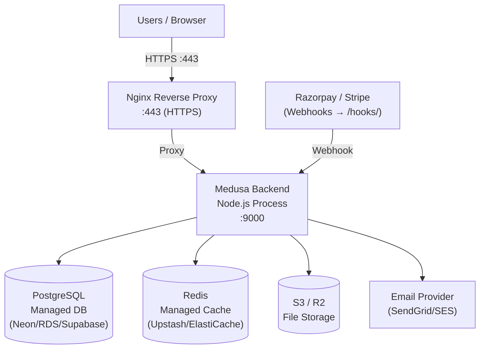

# 33 — Deployment Architecture
## letter-ink-backend · Infrastructure Analysis

> **Analysis only. Do not modify the codebase.**

---

## 1. Current Deployment State

**The repository has NO deployment infrastructure.**

| Expected File | Status |
|---|---|
| `Dockerfile` | **ABSENT** |
| `docker-compose.yml` | **ABSENT** |
| `.github/workflows/` | **ABSENT** |
| `nginx.conf` | **ABSENT** |
| `.env.production` | **ABSENT** |
| `Makefile` | **ABSENT** |
| `fly.toml` / `railway.toml` | **ABSENT** |

The application can only be run locally using `npm run backend:dev`.

---

## 2. Local Development

### How to Run

```bash
# From repository root
npm install
npm run backend:dev

# Equivalent to:
cd apps/backend
npx medusa develop

# Starts:
# - Medusa server on http://localhost:9000
# - Admin dashboard on http://localhost:9000/app
# - File watcher for TypeScript changes
```

### Prerequisites

```
✅ Node.js ^20.19.0 or >=22.12.0
✅ PostgreSQL (local, port 5432)
✅ Redis (local, port 6379)
✅ .env file with DATABASE_URL and REDIS_URL
✅ Database created: createdb medusa-letter-ink-backend
✅ Migrations run: npx medusa db:migrate
✅ Seed data: npm run seed (from apps/backend)
```

---

## 3. Build Process

```bash
npm run build
# → turbo build
# → medusa build
# → Output: apps/backend/.medusa/

# The build output at .medusa/server/ can be started with:
node .medusa/server/index.js
# or: npx medusa start
```

---

## 4. Recommended Production Architecture

For a Letter Ink production deployment, the following architecture is recommended:



### Option A: Docker on VPS (Recommended for cost)

```
Hetzner / DigitalOcean VPS (2-4 vCPU, 4-8GB RAM)
├── Nginx (reverse proxy + SSL via Let's Encrypt)
├── Docker container: Medusa backend
├── Managed PostgreSQL (Neon free tier → paid)
└── Managed Redis (Upstash free tier → paid)
```

### Option B: Railway.app (Recommended for simplicity)

```
Railway project:
├── Medusa backend service (Docker or buildpack)
├── PostgreSQL plugin
└── Redis plugin
```

### Option C: AWS (Recommended for scale)

```
AWS:
├── EC2 / ECS for Medusa backend
├── RDS PostgreSQL
├── ElastiCache Redis
├── S3 for file storage
├── SES for email
└── CloudFront for CDN
```

---

## 5. Required Infrastructure Files (To Be Created)

### `Dockerfile`

```dockerfile
FROM node:20-alpine AS builder
WORKDIR /app
COPY package*.json ./
COPY apps/backend/package*.json apps/backend/
RUN npm ci --workspace=apps/backend
COPY apps/backend/ apps/backend/
RUN npm run build --workspace=apps/backend

FROM node:20-alpine
WORKDIR /app
COPY --from=builder /app/apps/backend/.medusa/server ./server
COPY --from=builder /app/apps/backend/node_modules ./server/node_modules
ENV NODE_ENV=production
EXPOSE 9000
CMD ["node", "server/index.js"]
```

### `docker-compose.yml` (Local Development)

```yaml
version: "3.8"
services:
  backend:
    build: .
    ports:
      - "9000:9000"
    environment:
      DATABASE_URL: postgres://postgres:postgres@db:5432/medusa-letter-ink-backend
      REDIS_URL: redis://redis:6379
      JWT_SECRET: ${JWT_SECRET}
      COOKIE_SECRET: ${COOKIE_SECRET}
      STORE_CORS: http://localhost:3000
      ADMIN_CORS: http://localhost:9000
      AUTH_CORS: http://localhost:9000,http://localhost:3000
    depends_on:
      - db
      - redis
  db:
    image: postgres:15-alpine
    environment:
      POSTGRES_DB: medusa-letter-ink-backend
      POSTGRES_PASSWORD: postgres
    volumes:
      - pgdata:/var/lib/postgresql/data
  redis:
    image: redis:7-alpine
    volumes:
      - redisdata:/data
volumes:
  pgdata:
  redisdata:
```

### GitHub Actions CI/CD (`.github/workflows/deploy.yml`)

```yaml
name: Deploy
on:
  push:
    branches: [main]
jobs:
  test:
    runs-on: ubuntu-latest
    steps:
      - uses: actions/checkout@v4
      - uses: actions/setup-node@v4
        with: { node-version: "20" }
      - run: npm ci
      - run: npm test
  deploy:
    needs: test
    runs-on: ubuntu-latest
    steps:
      - uses: actions/checkout@v4
      - name: Deploy to production
        run: echo "Add deployment steps here"
```

---

## 6. Environment Variables for Production

| Variable | Source | Notes |
|---|---|---|
| `DATABASE_URL` | Secrets manager | Production DB connection |
| `REDIS_URL` | Secrets manager | Production Redis |
| `JWT_SECRET` | Secrets manager | 256-bit random |
| `COOKIE_SECRET` | Secrets manager | 256-bit random |
| `STORE_CORS` | Config | `https://letterink.com` |
| `ADMIN_CORS` | Config | `https://admin.letterink.com` or `https://letterink.com` |
| `AUTH_CORS` | Config | Same as STORE + ADMIN |
| `NODE_ENV` | Config | `production` |
| `RAZORPAY_KEY_ID` | Secrets manager | Payment |
| `RAZORPAY_KEY_SECRET` | Secrets manager | Payment |
| `SENDGRID_API_KEY` | Secrets manager | Email |
| `S3_BUCKET` | Config | File storage |
| `S3_ACCESS_KEY_ID` | Secrets manager | File storage |
| `S3_SECRET_ACCESS_KEY` | Secrets manager | File storage |

---

## 7. Database Migration Strategy for Production

```bash
# Run migrations before starting the new version:
npx medusa db:migrate

# Never run migrations alongside production traffic
# Use a pre-deployment migration step in CI/CD
```

**Note:** All Medusa migrations are forward-only (no automatic rollback). Maintain rollback scripts separately.

---

## 8. Health Check

Medusa provides a health endpoint at:

```
GET /health
→ { "status": "healthy" }
```

Use this for load balancer health checks and uptime monitoring.
